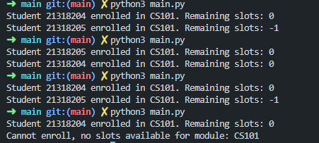
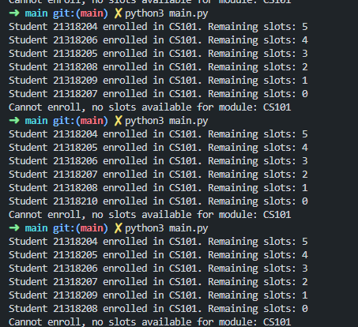

# Lab Week06

### Task 1
~~~
Task 1: Simulate a Race Condition 
• Simulate the race condition: Assume that two students attempt to enroll in a module 
with only one remaining slot at exactly the same time.  
• Steps: 
1. Simulate two students trying to enroll at the same time using 
the enroll function. 
2. Discuss the result: The race condition may cause both students to be enrolled, 
even though only one slot was available. 
~~~

So I modified the Enrollment class to look like so
~~~python
import multiprocessing # use for this lab race conditions

class Enrollment:

    def __init__(self, slots):
        self.students = {}
        self.modules = {}
        self.manager = multiprocessing.Manager()  
        self.slots = self.manager.Value('i', slots)  # https://docs.python.org/3/library/multiprocessing.html#multiprocessing.Manager
        

    # A method to add students
    def add_students(self, student):
        self.students[student.student_id] = student

    # A method to add modules  
    def add_modules(self, module):
        self.modules[module.module_code] = module

    # A method to check if a student can enroll in a module based on prerequisite completion
    def can_enroll(self, student_id, module_code):
        student = self.students.get(student_id)
        module = self.modules.get(module_code)
        if not student or not module:
            return False, "Student or module doesn't exist"

        prerequisites = [
            prereq for prereq in module.modules_done 
            if prereq not in student.completed_courses
        ]

        if prerequisites:
            return False, f"Cannot enroll, missing prerequisites: {', '.join(prerequisites)}"

        return True, f"Enrollment successful for module: {module_code}"

    # A method to enroll a student in a module 
    def enroll(self, student_id, module_code):
            # check if slot available
            if self.slots.value > 0:  # Check if slots are available for enrollment i.e. space in course
                can_enroll, message = self.can_enroll(student_id, module_code)
                if can_enroll:
                    self.slots.value -= 1  # if student can enroll, reduce slot count by 1 and enroll him
                    student = self.students[student_id]
                    student.course_complete(module_code)
                    return f"Student {student_id} enrolled in {module_code}. Remaining slots: {self.slots.value}"
                else:
                    return message
            else:
                return f"Cannot enroll, no slots available for module: {module_code}"

~~~
However, using this race conditon, you can get both students to be enrolled, which is not correct. There is no synchronisation here and will propogate erros which in a real world scenario would be bad say if it was enrolling in a course and two students were told they were enrolled but actually only one space left

### Task 2
~~~
ask 2: Analyze the Race Condition 
1. Discuss the consequences of race conditions in an enrollment system and how 
it can affect fairness and consistency. 
~~~
- Here again, say the non syncronisation part would be bad and cause system to be an inconsistent state and not accurate
- Would propogate a lack of trust in the system
- Increase the complexity of the code
Overall, it would be unfair to the users of the system and completely unreliable. You **MIGHT** get lucky and it will work, but if it doesn't. Could be very bad and could also cost a lot of money to reptify.

### Task 3
~~~
Task 3: Mitigate the Race Condition 
1. Implement race condition prevention strategies 
~~~
To Mitigate this, I used two simple lines of code, adding in a lock. This is in the multiprocessing library and bu using it ensure that only one thread or process can access a particular section of code when stated that modifies shared resources

Updated enrollment.py
~~~python
import multiprocessing # use for this lab race conditions

class Enrollment:

    def __init__(self, slots):
        self.students = {}
        self.modules = {}
        self.manager = multiprocessing.Manager()  # Manager for shared state across processes
        self.slots = self.manager.Value('i', slots)  # https://docs.python.org/3/library/multiprocessing.html#multiprocessing.Manager
        self.lock = multiprocessing.Lock() # https://docs.python.org/3/library/multiprocessing.html#multiprocessing.Lock

    # A method to add students
    def add_students(self, student):
        self.students[student.student_id] = student

    # A method to add modules  
    def add_modules(self, module):
        self.modules[module.module_code] = module

    # A method to check if a student can enroll in a module based on prerequisite completion
    def can_enroll(self, student_id, module_code):
        student = self.students.get(student_id)
        module = self.modules.get(module_code)
        if not student or not module:
            return False, "Student or module doesn't exist"

        prerequisites = [
            prereq for prereq in module.modules_done 
            if prereq not in student.completed_courses
        ]

        if prerequisites:
            return False, f"Cannot enroll, missing prerequisites: {', '.join(prerequisites)}"

        return True, f"Enrollment successful for module: {module_code}"

    # A method to enroll a student in a module with multiprocessing handling
    def enroll(self, student_id, module_code):
        with self.lock:  # ensures that only one proess can access this part of code at a time
            if self.slots.value > 0:  # Check if slots are available for enrollment i.e. space in course
                can_enroll, message = self.can_enroll(student_id, module_code)
                if can_enroll:
                    self.slots.value -= 1  # if student can enroll, reduce slot count by 1 and enroll
                    student = self.students[student_id]
                    student.course_complete(module_code)
                    return f"Student {student_id} enrolled in {module_code}. Remaining slots: {self.slots.value}"
                else:
                    return message
            else:
                return f"Cannot enroll, no slots available for module: {module_code}"
~~~

Output:

So I did with 7 students testing enrollment when 6  slots were available for one course:

YOu can see taht it will also give the same error for another extra student trying to enroll, not satying he is enrolled when shoudnt

The output is different eachtime as when use multiprocessing, each req is handled in a seperate process that do not execute in a sequential manner, they run concurrently